**Enabling Conditional MFA in IDCS**

**Introduction**

Multi-Factor Authentication (MFA) is a method of authentication that requires the use of more than one factor to verify a user’s identity.

With MFA enabled in Oracle Identity Cloud Service, when a user signs in to an application, they are prompted for their user name and password, which is the first factor – something that they know. The user is then required to provide a second type of verification. This is called 2-Step Verification. The two factors work together to add an additional layer of security by using either additional information or a second device to verify the user’s identity and complete the login process.

Users are increasingly connected, accessing their accounts and applications from anywhere. As an administrator, when you add MFA on top of the traditional user name and password, that helps you to protect access to data and applications. This also reduces the likelihood of online identity theft and fraud, which secures your business applications even if an account password is compromised.

Estimated Lab Time: 20 minutes

**Objectives**

In this lab, you will:

-   select MFA factors that you want to enable
-   define a Sign-On Policy for Salesforce
-   sign-in as an end user with MFA
-   block access via policy
-   test the updated policy

**Prerequisites**

-   An Oracle Free Tier or Paid Account
-   A Google Account
-   A Salesforce Developer Account
-   Lab 2 was completed

Collapse All Tasks

**Task 1: Enable MFA Factors**

-   *Personas*:
    -   Administrator
1.  Login into IDCS Admin console as an administrator:

    https://\<your tenant\>/ui/v1/adminconsole

2.  Navigate to *Security* and select *MFA*.
3.  Select the *MFA factors* that you want to enable and then click on *Save*.

    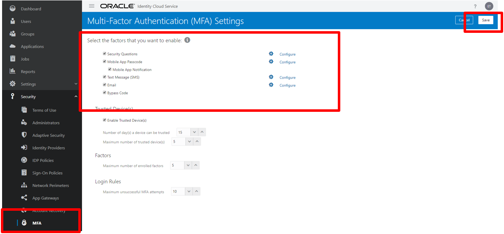

**Task 2: Define a Sign-On Policy for Salesforce**

-   *Personas*:
    -   Administrator

A sign-on policy allows identity domain administrators, security administrators, and application administrators to define criteria that Oracle Identity Cloud Service uses to determine whether to allow a user to sign in to Oracle Identity Cloud Service or prevent a user from accessing Oracle Identity Cloud Service.

Oracle Identity Cloud Service provides you with a default sign-on policy that contains a default sign-on rule. Oracle Identity Cloud Service evaluates the criteria of the rule for any user attempting to sign in to Oracle Identity Cloud Service. By default, this rule allows all users to sign in to Oracle Identity Cloud Service. This means whichever authentication the user uses, either local authentication, by supplying a user name and password, or authentication by using an external identity provider, will be sufficient.

However, you can build upon this policy by adding other sign-on rules to it. By adding these rules, you can prevent some of your users from signing in to Oracle Identity Cloud Service. Or, you can allow them to sign in, but prompt them for an additional factor to access resources that are protected by Oracle Identity Cloud Service, such as the My Profile console or the Identity Cloud Service console.

1.  Navigate to *Security* and then select *Network Perimeters*.

    

    A network perimeter contains a list of IP addresses.

    After creating a network perimeter, you can prevent users from signing in to Oracle Identity Cloud Service if they use one of the IP addresses in the network perimeter. This is known as blacklisting. A blacklist contains IP addresses or domains that are suspicious. As an example, a user may be trying to sign in to Oracle Identity Cloud Service with an IP address that comes from a country where hacking is rampant.

    You can also configure Oracle Identity Cloud Service so that users can log in, using only IP addresses contained in the network perimeter. This is known as whitelisting, where users who attempt to sign in to Oracle Identity Cloud Service with these IP addresses will be accepted. Whitelisting is the reverse of blacklisting, the practice of identifying IP addresses that are suspicious, and as a result, will be denied access to Oracle Identity Cloud Service.

2.  Click on *Add* to add a new Network Perimeter. Enter an IP range as shown below. For now, put a dummy range or even a dummy address (e.g 10.0.0.0), so that no authentication is denied and click *Save*.

    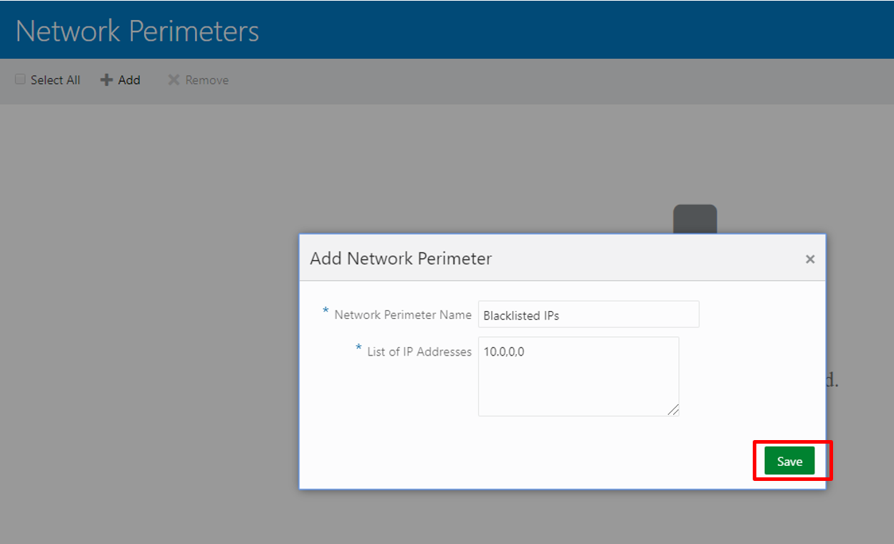

3.  Navigate to *Security* and select *Sign On policies*. To define a Sign-On-Policy for the Salesforce App click on *Add*.

    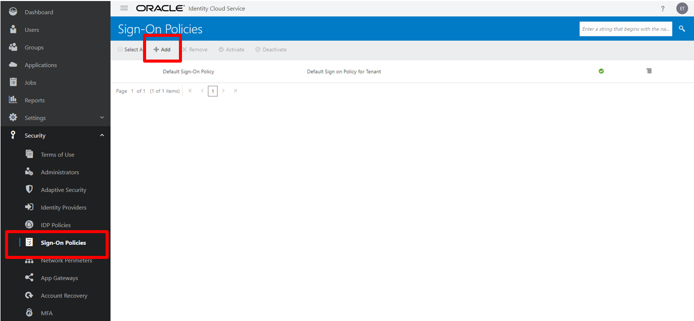

    Note that a Default Sign-On Policy exists and is enabled by default. The default policy applies to all application that have not been explicitly mapped to a sign on policy.

4.  Enter a *Policy Name* and *Description* in the Details section and click on *\>* button to move to the next section.

    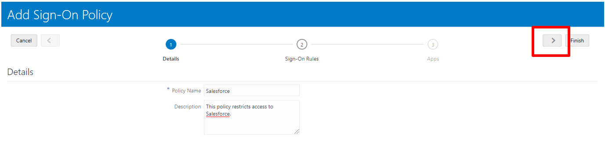

5.  In the *Sign-On Rules* section click on *Add Rules* to add a new rule.

    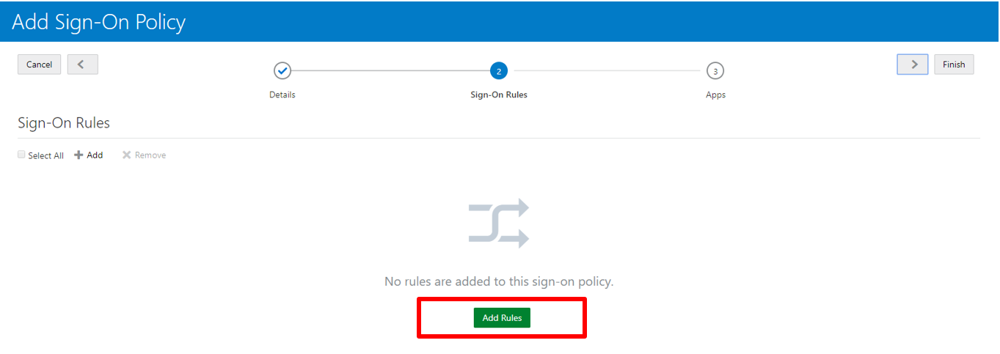

6.  Create a rule to prompt for MFA when a user belongs to the Employees group. Ensure following parameters are set:

| Table 1: Oracle Identity Cloud Service Introductory Workshop \| Lab 5: Enabling Conditional MFA in IDCS |                   |
|---------------------------------------------------------------------------------------------------------|-------------------|
| **Parameter**                                                                                           | **Value**         |
| Rule Name                                                                                               | MFA for Employees |
| And is a member of these Groups                                                                         | Employee          |
| Prompt for additional Factor                                                                            | Checked           |
| Enrollment                                                                                              | Optional          |
| Frequency of additional factor when using a trusted device                                              | Once per Session  |

1.  Click *Save* in order to save the rule

    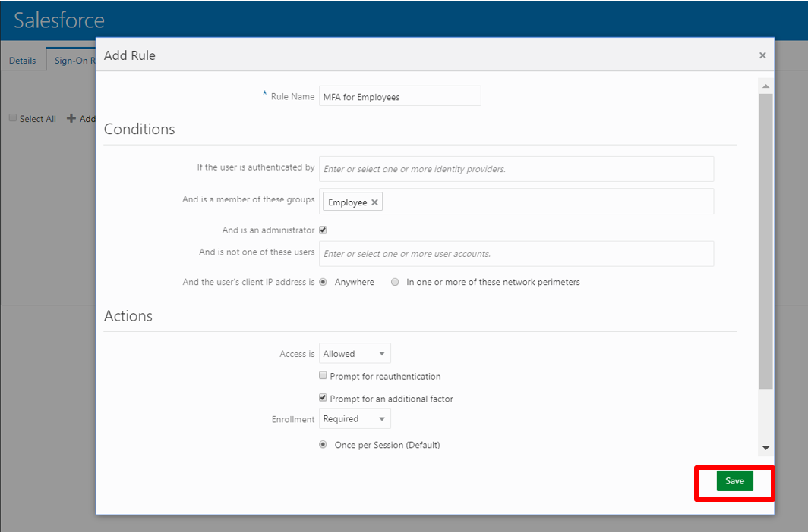

2.  Click *Add* to add a second rule.

    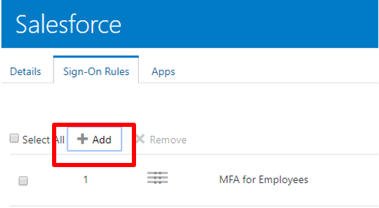

3.  Ensure following parameters are set:

| Table 2: Oracle Identity Cloud Service Introductory Workshop \| Lab 5: Enabling Conditional MFA in IDCS |                                                   |
|---------------------------------------------------------------------------------------------------------|---------------------------------------------------|
| **Parameter**                                                                                           | **Value**                                         |
| Rule Name                                                                                               | Blacklisted IP                                    |
| And user’s client IP address is                                                                         | In one or more of these networks Blacklisted IP’s |
| Access is                                                                                               | Denied                                            |

1.  Click *Save* in order to save the rule

    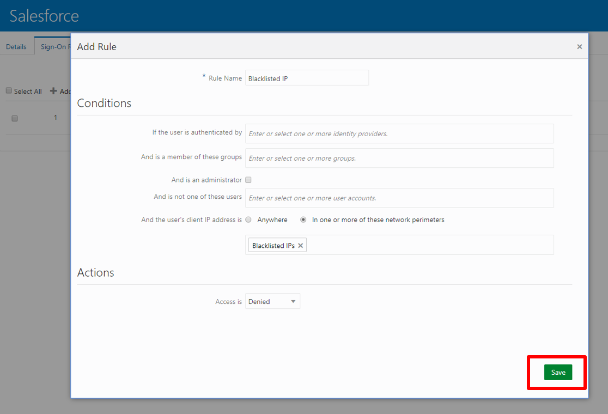

    Note the Sign-On Rules are ordered. The actions (allow/deny/prompt for MFA) are determined by the first rule where the conditions match. If none of the rule conditions match the default action is deny.

2.  To move the *Blacklisted IP* rule to the top click on the reorder icon and drag the rule to the top. Click *Finish*.

    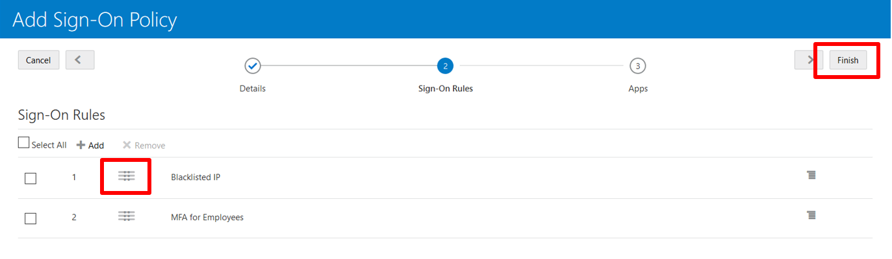

    The above rules are evaluated as below

    a. if user access is from a blacklisted IP the deny access.

    b. if user is a member of Salesforce Employee group, then prompt for MFA once per session.

    c. for all other users deny access.

3.  Click on the *Apps* tab and click on the *Assign* button.

    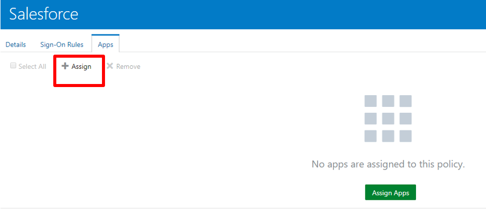

4.  Select the *Salesforce* application and click *OK*.

    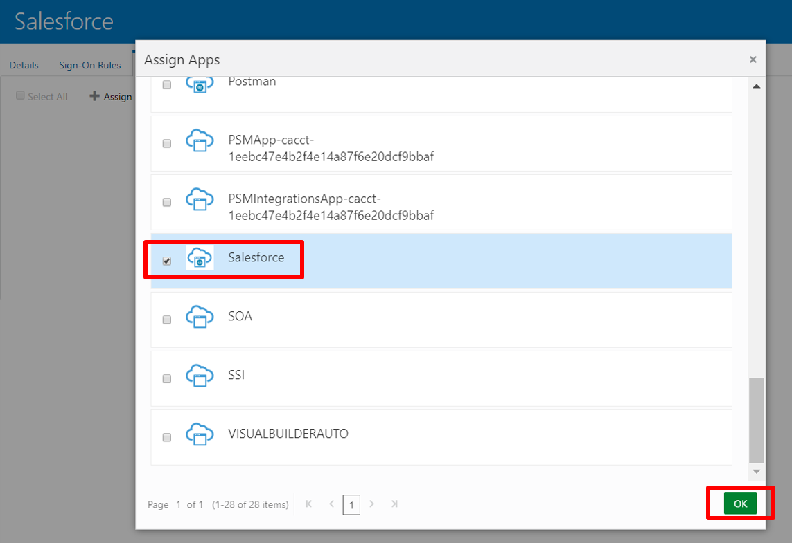

5.  Salesforce has been successfully added to the Sign-On Policy.

    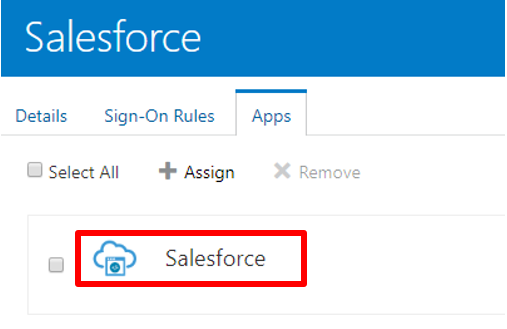

6.  Navigate back to *Sign-On Policies* and click on *Activate* in order to activate the *Salesforce* policy.

    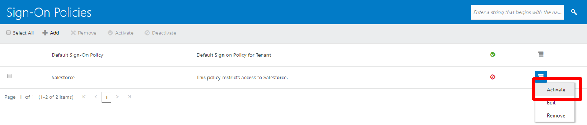

**Task 3: Sign-in as an end user with MFA**

-   *Personas*:
    -   End User
1.  Sign in to IDCS console with a user account that has been assigned to the Salesforce application.
2.  Click on *Salesforce Chatter*.

    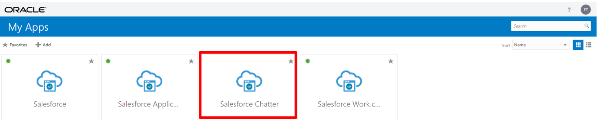

3.  You will be prompted to enable 2-Step verification for your account. Click on *Enable* to enable 2-Step Verification for the account. Note as Enrollment was set as Optional in the Sign-On policy the end user is given the option to skip this step.

    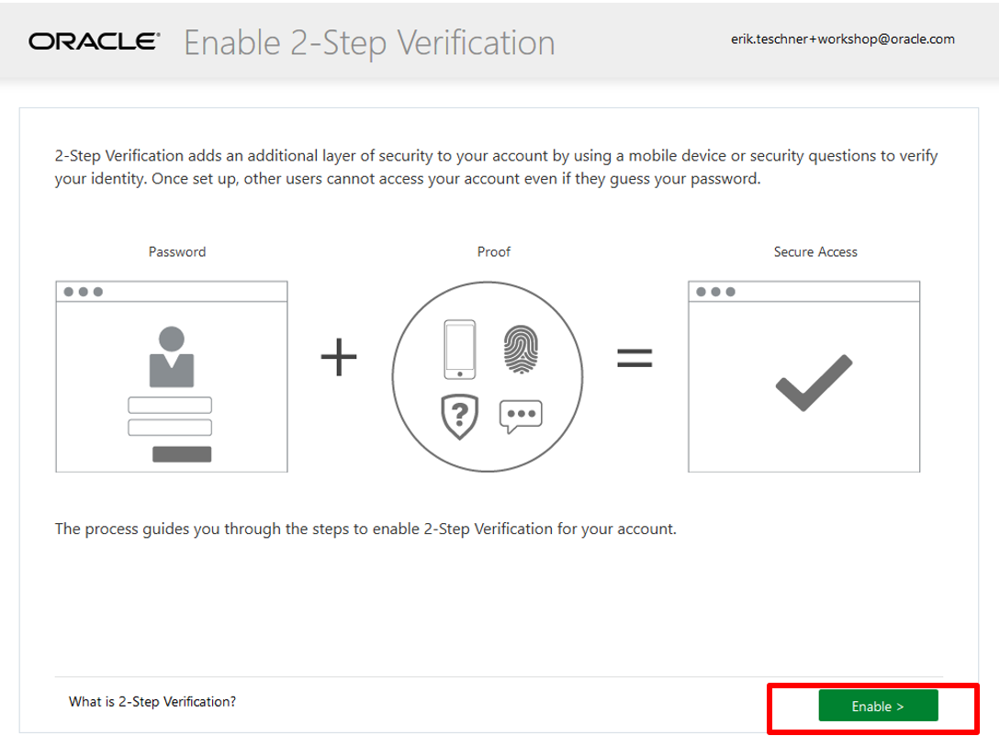

**MFA Options in Oracle Identity Cloud Service: Email**

Email:

Users receive an email message that contains a temporary passcode that must be used during log in.

A. Oracle automatically sets your main email account as a MFA option. However, it is recommended to click the option *Set as Default*.

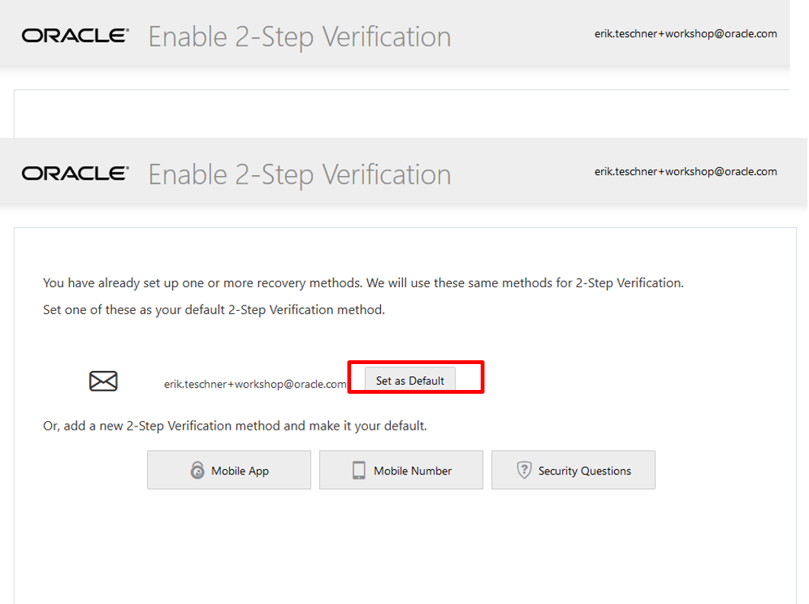

B. Enter the code that has been sent to your email address and click *Verify*.

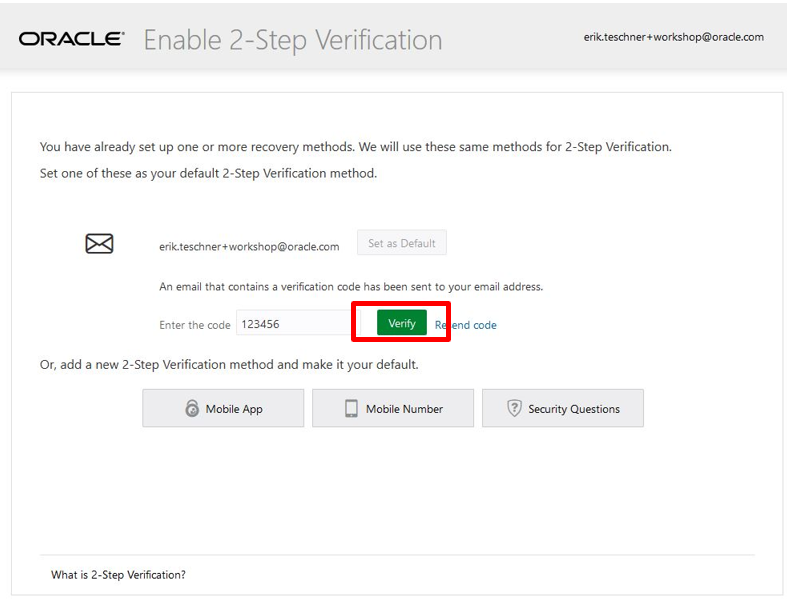

C. Now, your email address is successfully enrolled. It is recommended to set up an additional method. To continue with the MFA configuration, select another method, i.e. *Mobile App*. You can also choose to click *Done* and finish the MFA configuration.

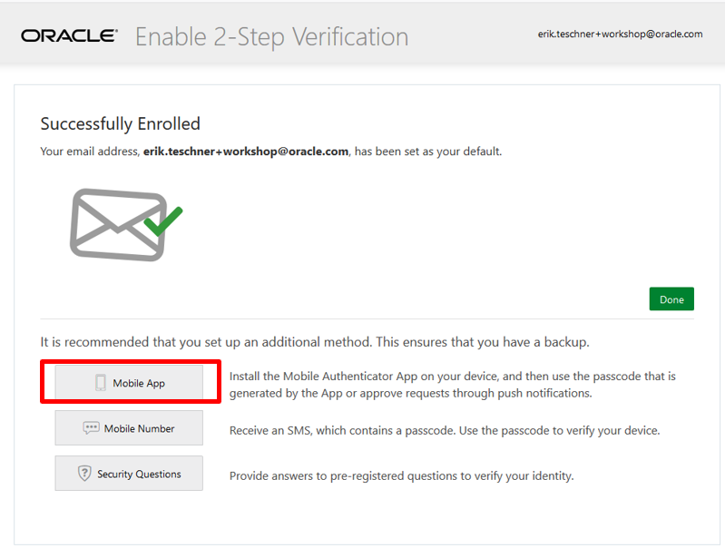

Note: Under \*My Profile\* and under the tab \*Security\*, further MFA options can be configured at a later point of time.

**MFA Options in Oracle Identity Cloud Service: Mobile Authenticator Application**

Mobile Authenticator Application:

Users generate an OTP on the OMA App on their device that must be used during log in.

A. Download the *Oracle Mobile Authenticator* app on your mobile phone.

B. If your mobile has internet connectivity, scan the QR code.

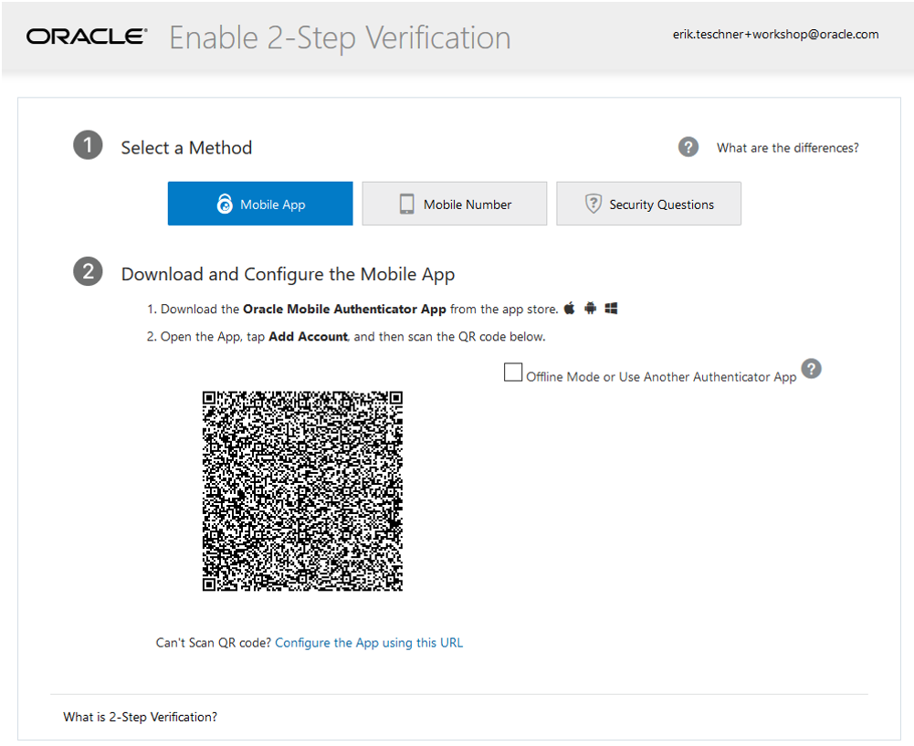

C. If your mobile phone does not have internet connectivity or you are using a 3rd party authenticator (e.g. Google Authenticator) i. Tick the box *Offline Mode or Use Another Authenticator App* and scan the new offline QR code that is generated. After you scan the QR code, the mobile app will generate OTP’s every 30 seconds. ii. Enter the OTP in the passcode field and click *Verify*.

D. You can enroll an additional 2-Step Verification method by clicking on another method. In this tutorial, we continue with *Mobile Number*.

**MFA Options in Oracle Identity Cloud Service: Text Message (SMS)**

Text Message (SMS):

Users receive a temporary passcode as a text message (SMS) on their device that must be used during log in.

A. Click on *Mobile Number*.

B. Enter your mobile number and click on *Send*.

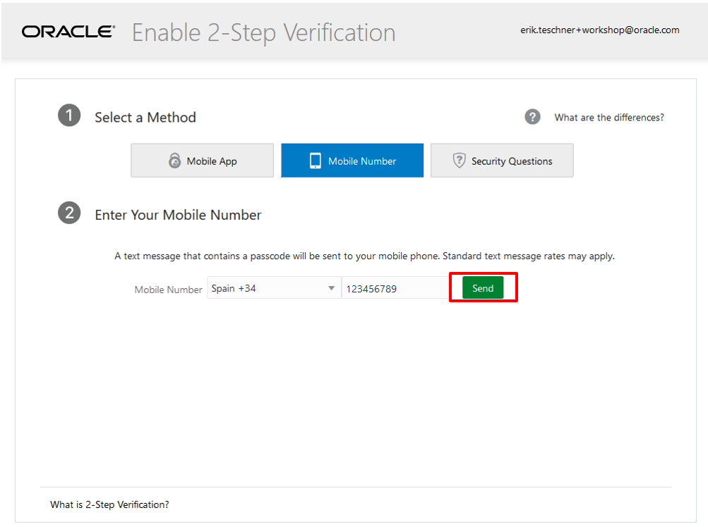

C. An *SMS* (text message) containing an OTP will be sent to your mobile number.

D. Enter the OTP in the passcode field and click on *Verify*.

**MFA Options in Oracle Identity Cloud Service: Security Questions**

Security Questions:

Users are prompted during the sign-in process to correctly answer a defined number of security questions to verify their identity.

A. Click on *Security Questions*.

B. Select question that you want to use, enter answers that you will remember and optionally enter hits for each answer and click *Save*.

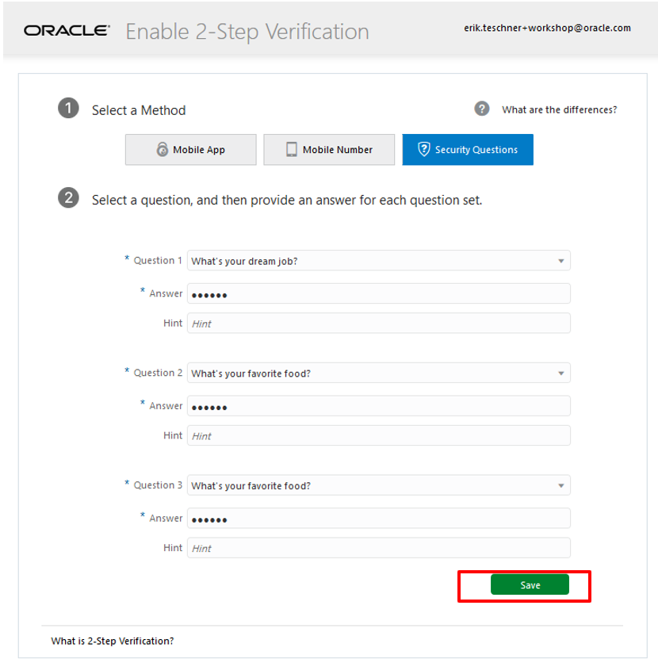

C. Click on *Done* to complete the process. You will be now redirected to Salesforce.

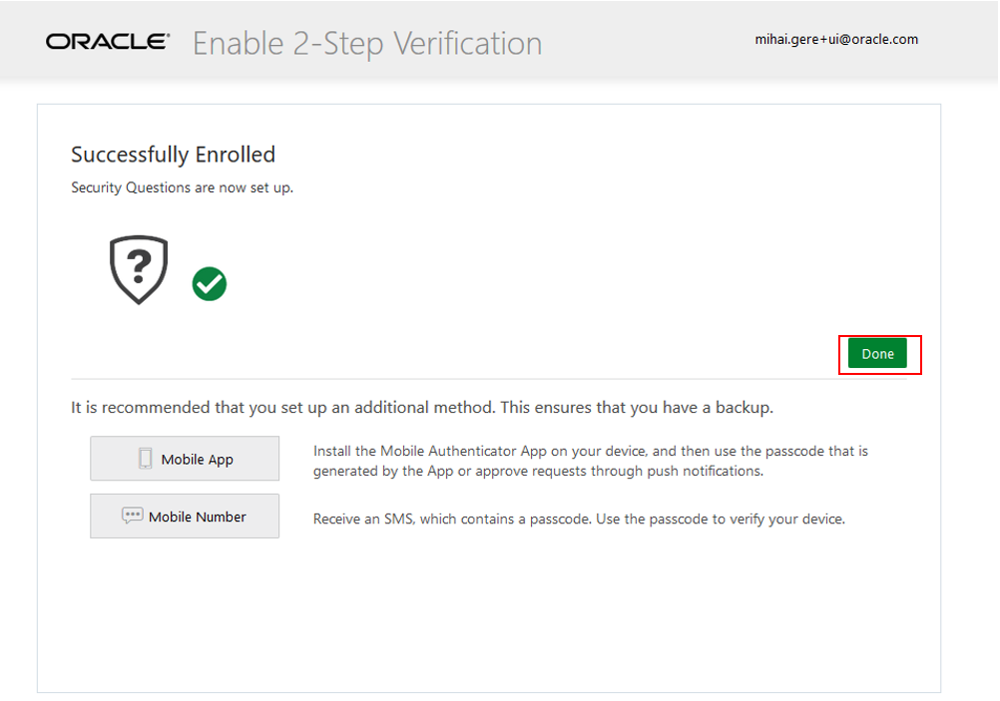

**MFA Options in Oracle Identity Cloud Service: Backup verification method**

Backup verification method:

Oracle makes it possible to use a backup verification method in case the current MFA option cannot be entered, i.e. when the configured MFA device is not reachable.

A. Access IDCS and under My Apps select Salesforce. A preconfigured MFA option will show up. In this case, it is the *Mobile Authenticator Application*.

B. Click on *Use backup verification method*. The list of enrolled backup 2-Step Verification methods is displayed.

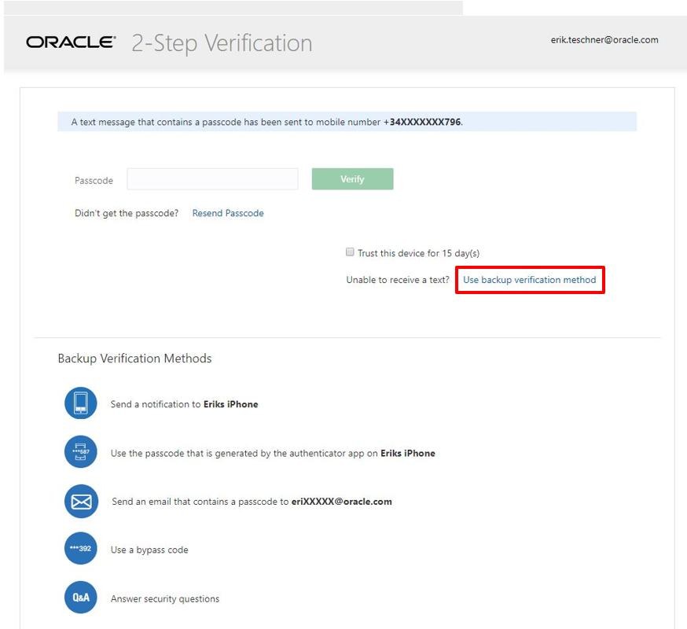

C. In this example, select *Security Questions*.

D. Answer the security Question and click *Verify* .

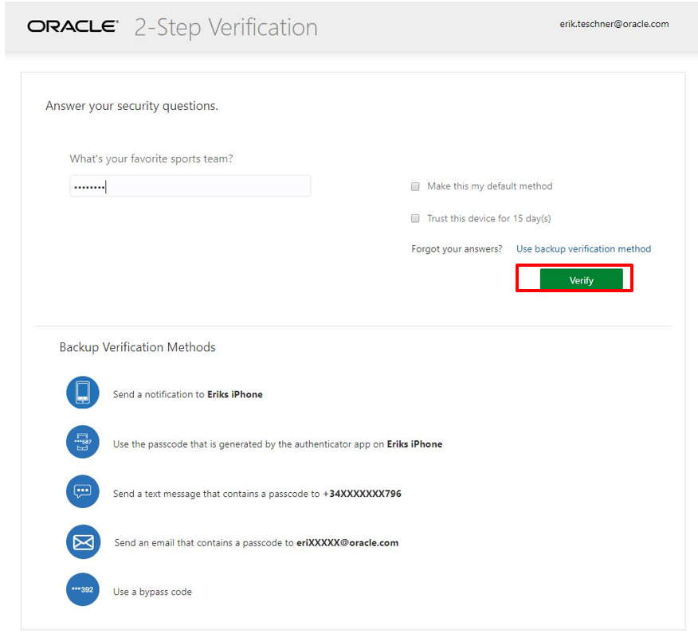

**Task 4: Block access via policy**

-   *Personas*:
    -   Administrator
-   Block blacklisted IPs

    After creating a network perimeter, you can prevent users from signing in to Oracle Identity Cloud Service if they use one of the IP addresses in the network perimeter. This is known as blacklisting. A blacklist contains IP addresses or domains that are suspicious. As an example, a user may be trying to sign in to Oracle Identity Cloud Service with an IP address that comes from a country where hacking is rampant.

1.  Navigate to *Security* and select *Network Perimeters*. Click the menu on the right of the Blacklisted IPs Network Perimeter you created earlier and click Edit. The previously configured dummy IP address will be shown.

    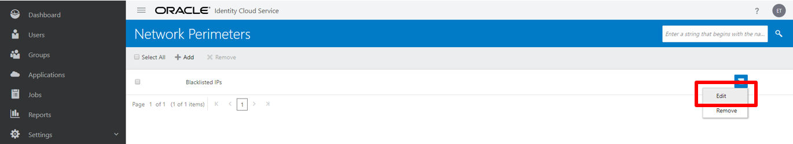

2.  Change the dummy IP to your IP range:
-   Open a web browser and access a website that shows your *public IP address*, for example: https://www.whatismyip.com/
-   Copy your public IP address.
-   Go back to IDCS and replace the dummy IP address with your public IP address and click *Save*.

    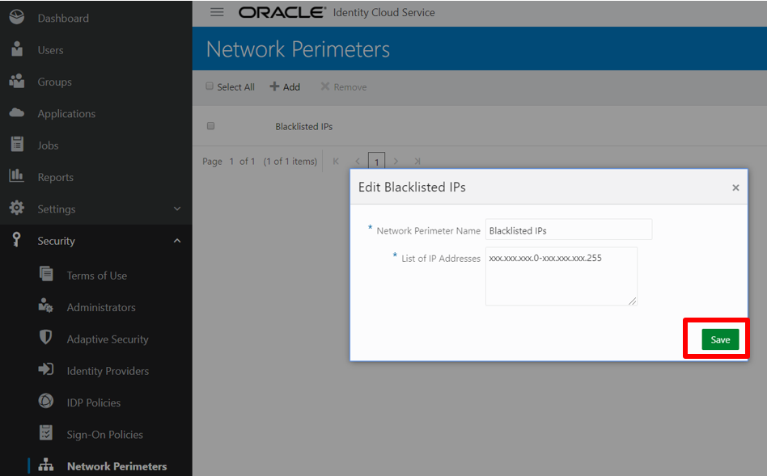

**Task 5: Test the updated policy**

-   *Personas*:
    -   End User
1.  Sign in to IDCS console with a user account that has been assigned to the Salesforce application.
2.  Click on the *Salesforce Chatter* tile.

    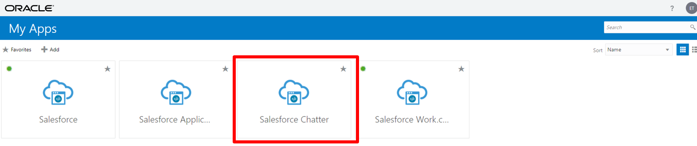

3.  You will denied access, given that your request originates in a blacklisted IP.

    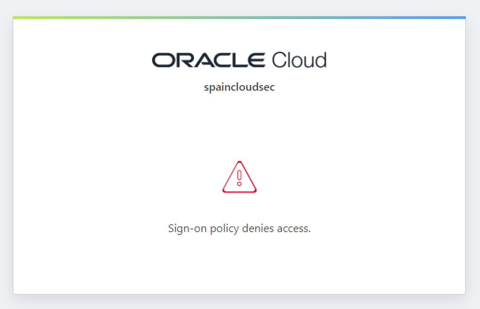

You may now proceed to the next lab
