**Enabling Adaptive MFA in IDCS**

**Introduction**

Adaptive Security is an advanced feature that provides strong authentication capabilities for your users, based on their behavior within Oracle Identity Cloud Service, and across multiple heterogeneous on-premises applications and cloud services. When activated, the Adaptive Security feature can analyze a user’s risk profile within Oracle Identity Cloud Service based on their historical behavior, such as too many unsuccessful login attempts, too many unsuccessful MFA attempts, and real-time device context like logins from unknown devices, access from unknown locations, blacklisted IP addresses, and so on.

Estimated Lab Time: 20 minutes

**Objectives**

In this lab, you will:

-   enable Risk Provider
-   use Risk as a condition in Sign-On Policy
-   evaluate End User risk

**Prerequisites**

-   An Oracle Free Tier or Paid Account
-   A Google Account
-   A Salesforce Developer Account
-   Lab 2 was completed

Collapse All Tasks

**Task 1: Enabling Risk Provider**

-   *Personas*:
    -   Administrator
1.  Login into IDCS Admin console as an administrator:

    https://\<your tenant\>/ui/v1/adminconsole

2.  Navigate to *Security* and select *Adaptive Security*.
3.  The list of Risk Providers is displayed.
4.  Select *Edit* from the Default Risk provider menu.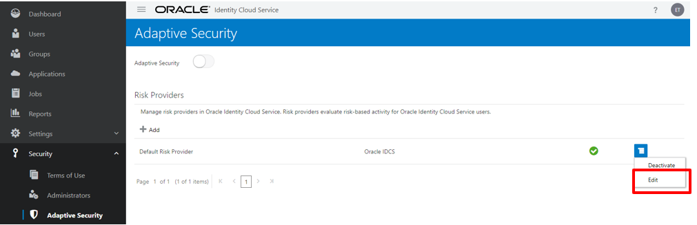

    Note: Adaptive Security uses the concept of risk providers to allow identity domain administrators and security administrators to configure various contextual and threat events to be analyzed within Oracle Identity Cloud Service, and also to configure and consume user risk scores from third-party risk providers.

    A default risk provider within Oracle Identity Cloud Service is seeded automatically with a list of supported contextual and threat events, such as too many unsuccessful login attempts, too many unsuccessful MFA attempts, and access from unknown devices. Administrators can enable events of interest and specify weighting or severity for each of these events. The system uses the configured weighting to compute the user’s Oracle Identity Cloud Service risk score.

5.  On this page you can view or edit the Default Risk provider configurations.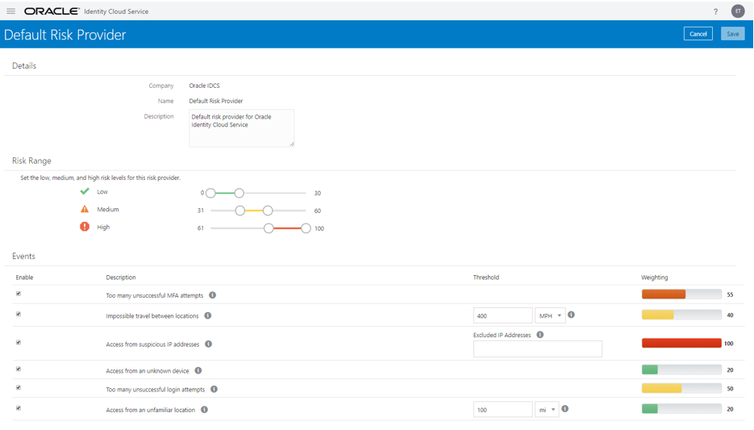
6.  You can adjust the Low, Medium and High Risk Range.
7.  You can select risk events that you want to enable/disable and also associate a risk score with the event.
8.  Click on the Navigation Drawer and navigate back to *Security* and select *Adaptive Security*.
9.  Click on the *Adaptive Security* toggle located at the top of the page to enable the feature.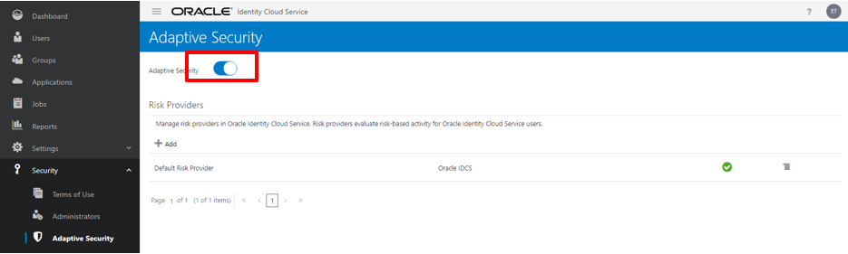
10. You can add additional Risk Providers by clicking on the *Add* button. IDCS currently support integration with Symantec Cloud SOC. Integration with Oracle CASB and other 3rd party risk providers are also planned.
11. For this lab, we will use the Default Risk Provider.

**Task 2: Use Risk as a condition in Sign-On Policy**

-   *Personas*:
    -   Administrator
1.  Login into IDCS Admin console as an administrator:

    https://\<your tenant\>/ui/v1/adminconsole

2.  Navigate to *Security* and select *Sign-On Policies*.
3.  Click on *Edit* to edit the Salesforce App Policy.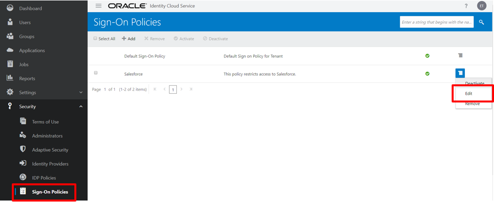
4.  Navigate to the *Sign-On Rules* tab and click *Edit* in order to change the *MFA for Employees* rule.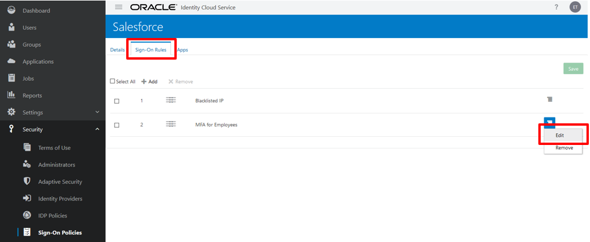
5.  Add the following parameters and click *Save*.

| Table 1: Oracle Identity Cloud Service Introductory Workshop \| Lab 6: Enabling Adaptive MFA in IDCS |                                    |
|------------------------------------------------------------------------------------------------------|------------------------------------|
| **Parameter**                                                                                        | **Value**                          |
| Operator                                                                                             | \< (less than; default is greater) |
| Risk Provider Name                                                                                   | Default Risk Provider              |
| Score                                                                                                | 90                                 |

1.  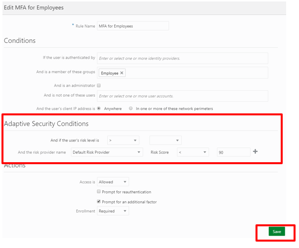
2.  The Sign-On rules for the Salesforce App are evaluated as below
    -   if user access is from a blacklisted IP the block access.
    -   if user is a member of Salesforce Employee group and Risk Score is less than 90, then prompt for MFA once per session.
    -   for all other users deny access.

        Note: if the user is a member of the Salesforce Employee group and Risk Score is greater than 90 access will be denied.

        Note: if you have multiple risk providers then you can define conditions based on consolidated risk score or risk score generated by a specific set of providers.

**Task 3: End User risk evaluation**

-   *Personas*:
    -   Administrator
    -   End User
1.  Login into IDCS Admin console as an administrator:

    https://\<your tenant\>/ui/v1/adminconsole

2.  Navigate to *User* and click on *Add*.
3.  Create a user like the one below and click Finish.
    -   First Name: Firstname
    -   Last Name: Lastname
    -   User Name/Email: firstname.lastname+risk@domain.tld

        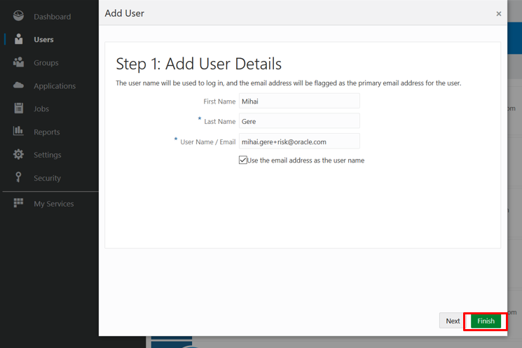

4.  As an administrator, login to Salesforce and create a regular user with the same details as above. The final user should look as per below example:

    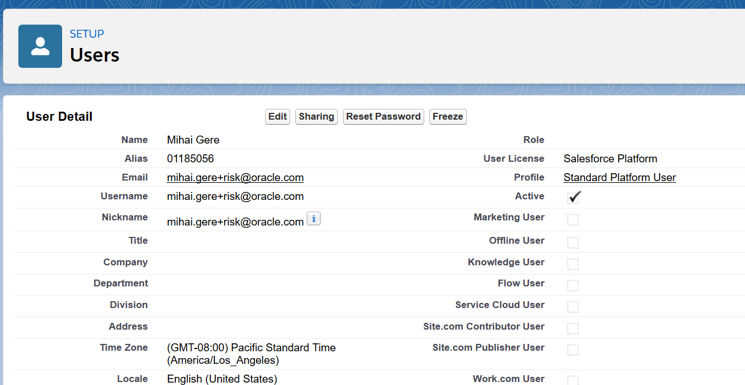

5.  Select the group *Employee* and click on *Finish*.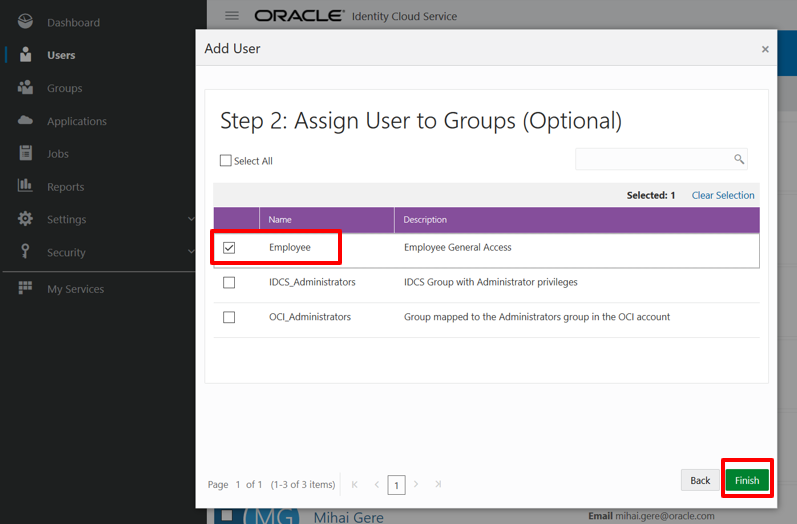
6.  *Logout* of IDCS.
7.  Activate the user by clicking on the activation link called *Activate Your Account* that was sent to the user’s email address.

    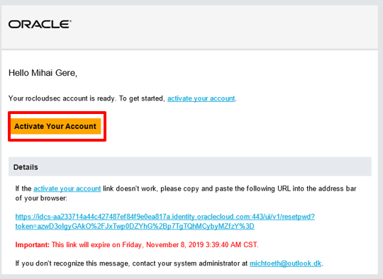

8.  Enter a *password* when prompted.
9.  After you received the Congratulations page, *login* to IDCS with your newly created user.
10. Click on the *Salesforce Chatter* tile to launch the application in a new tab.

    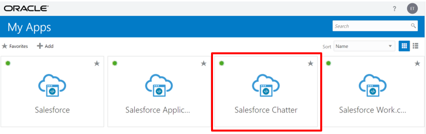

Note: If your login is not allowed based on the previously configured blacklisted IP, please log back in as an administrator, replace existing blocked IPs with a dummy value, such as 10.0.0.0 and retry above steps.

1.  Click on *Enable* to enable 2-Step verification
2.  Enroll any 2-Step verification, i.e. Mobile App.
3.  Click *Done* and you will be signed in to Salesforce.
4.  Login to IDCS Admin console as an administrator

    https:///ui/v1/adminconsole

5.  Click on Users and navigate to the user that was newly created for testing risk. Notice that each user now has an associated risk. Click on that user.

    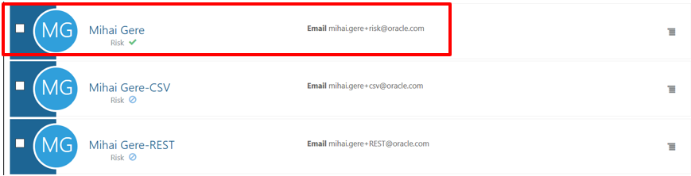

6.  Click on the *Security* tab. The Default Risk Provider has generated a risk score of 15 or 30 for this user based on the risk events that we enabled and configured.

    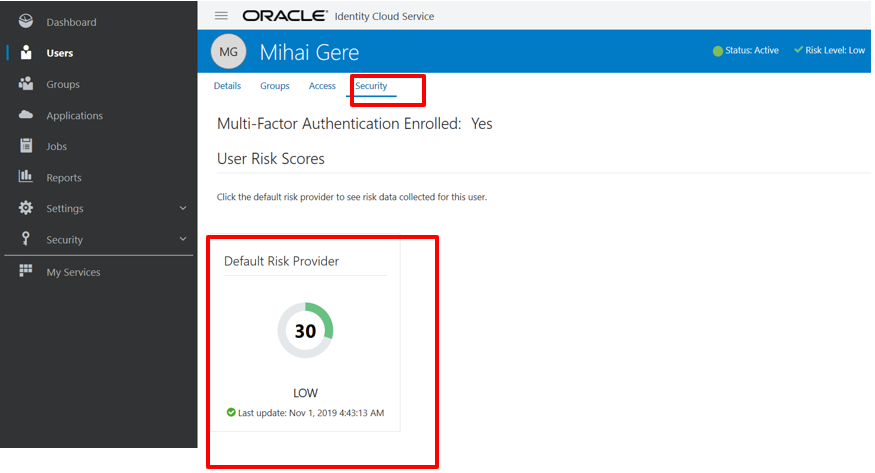

Note: if multiple risk providers were configured, one tile would be shown for each provider.

1.  Click on the Default Risk Provider tile and then scroll down to view Risk Incident Details. On this page, you get a historical view of risk score and the list of Risk Events.

    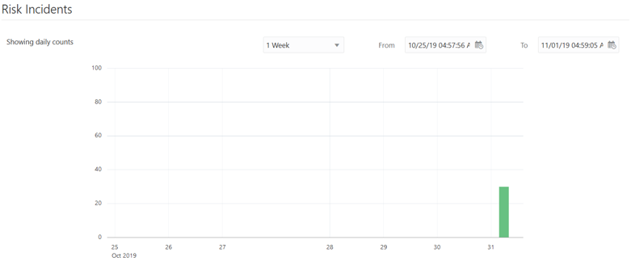

**Additional Information**

This workbook is primarily designed to provide the necessary instructions and context to allow you to complete the labs in the Oracle Identity Cloud Service Workshop. If you would like additional information about the Oracle solution, you can contact your local Oracle account team and/or review some of the following publicly available information about the solution.

-   [Identity Cloud Service website](https://cloud.oracle.com/en_US/identity)
-   [Solution Data Sheet](http://www.oracle.com/technetwork/middleware/id-mgmt/overview/idcs-datasheet-3097388.pdf)
-   [Product documentation](http://docs.oracle.com/cloud/latest/identity-cloud/index.html)
-   [Blogs](https://blogs.oracle.com/imc/)
